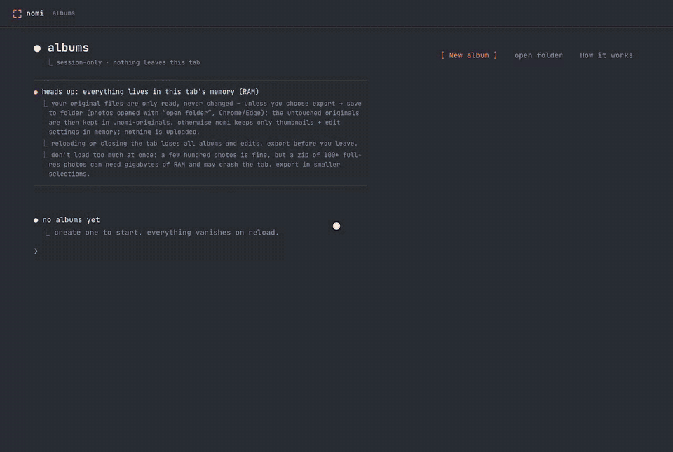

# nomi

A minimalist photo editor that runs entirely in your browser tab. There's no backend and no account, and nothing is uploaded.



## How it works

1. **New album**, name it, and import photos (or drag and drop them anywhere).
2. Click a photo to edit it: **adjust** (11 Apple Photos-style sliders), **filters**, **crop** (aspect ratios, rotate, straighten) or **text**.
3. **Done** → **↓ export** gives you a full-resolution ZIP. In Chrome and Edge you can also save back to a folder opened with **open folder**, and the originals are backed up in `.nomi-originals/`.

Everything lives in the tab's memory, so reloading clears it. Export before you leave.

## Run

```bash
python3 -m http.server 8811
# open http://localhost:8811
```

Plain HTML, ES modules and WebGL2, with zero dependencies. Tests: `node tests/run.js`. The full feature notes are in [docs/features.md](docs/features.md).
